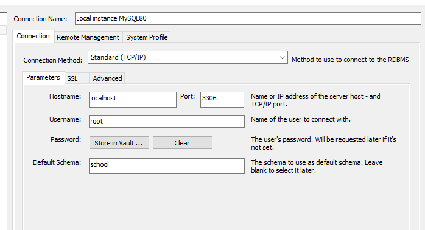

**Projeto Cadastro de Professor**

Para rodar o projeto é necessário ter instalado:
- Java 11
- Maven versão 3 ou acima
- MySQL
- alguma IDE que rode Java
- Postman(opção web para linux) para testar as APIs

O banco foi configurado no modo default e criado um schema padrão 'school'
- 

A porta que irá rodar será localhost:8080,
para testar os endpoints é necessário importar o collection do postman que disponibilizei na pasta raiz.